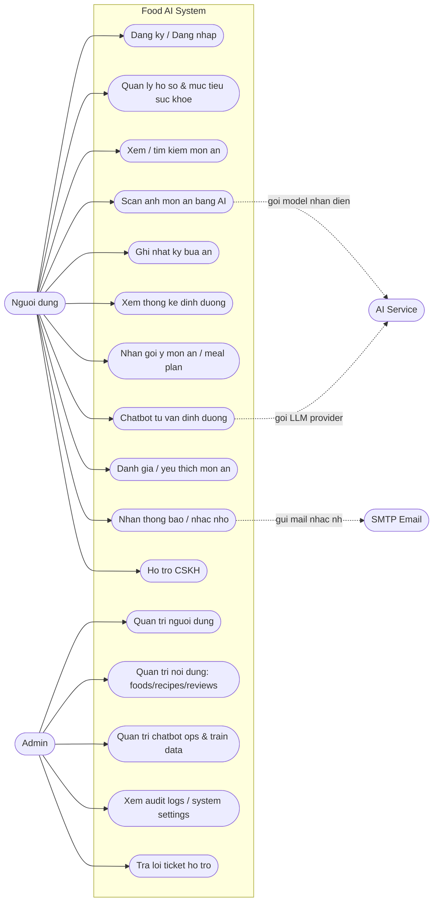
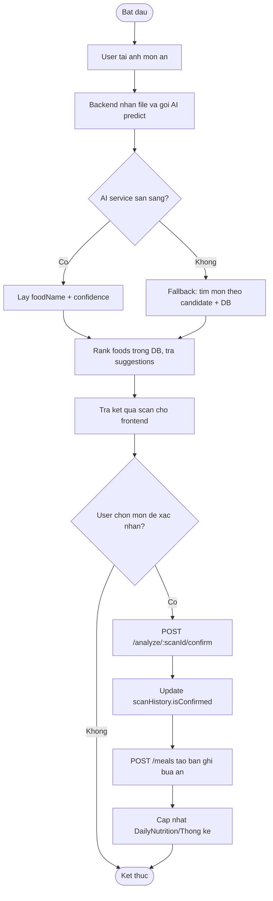
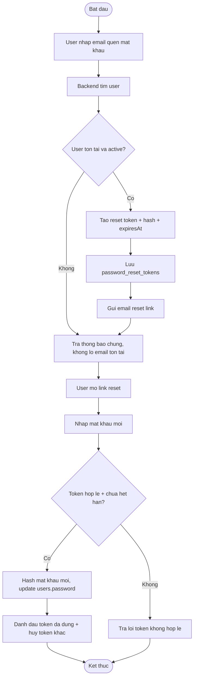
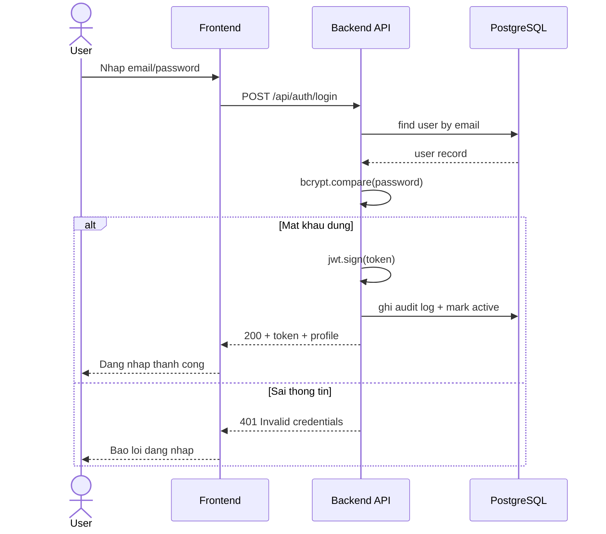
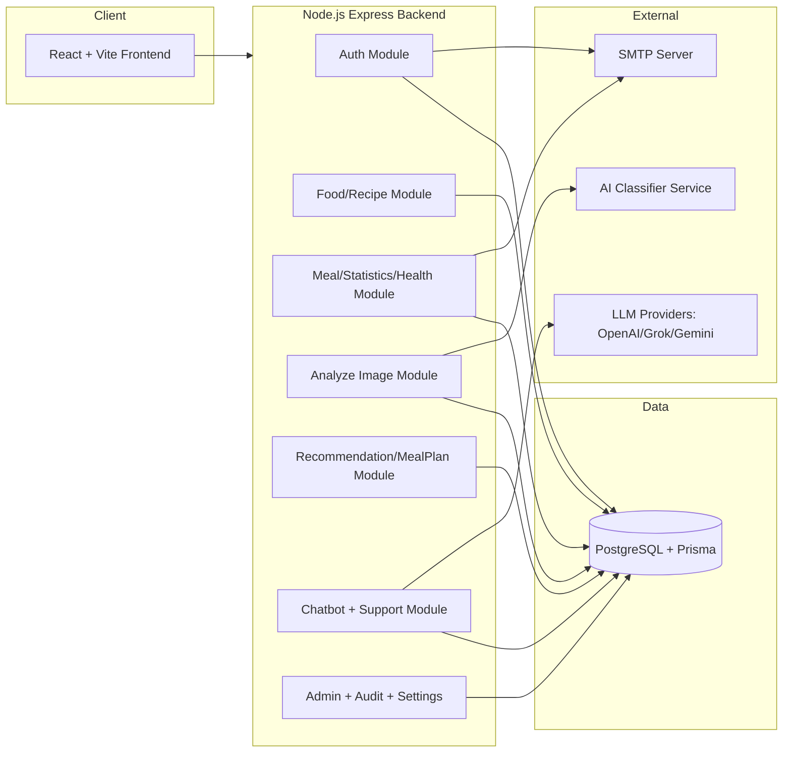
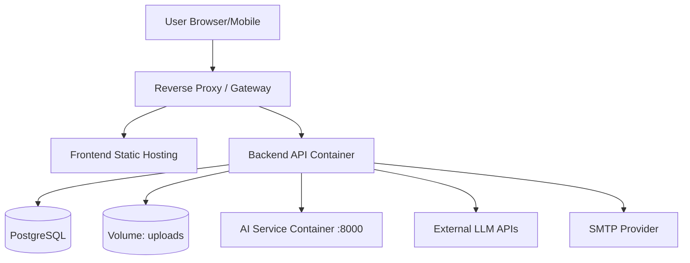

# Food AI Project - Bo so do nghiep vu va kien truc

Tai lieu nay tong hop cac so do chinh cho du an: Use Case, Activity, Sequence, ERD, Component va Deployment.

## 1) Use Case Diagram (Tong quan he thong)

## 2) Activity Diagram (Luong Scan anh -> Xac nhan -> Luu bua an)

## 3) Activity Diagram (Forgot Password)

## 4) Sequence Diagram (Dang nhap)

## 5) ER Diagram (Rut gon tu Prisma)

PlantUML source day du: `docs/diagrams/puml/du_lieu_he_thong_erd.puml`
Rendered image: `docs/diagrams/images/du_lieu_he_thong_erd.png`

```mermaid
erDiagram
    USER ||--o| USER_PROFILE : has
    USER ||--o{ USER_GOAL : defines
    USER ||--o{ USER_HEALTH_METRIC : records
    USER ||--o{ MEAL : logs
    USER ||--o{ SCAN_HISTORY : creates
    USER ||--o{ FAVORITE : marks
    USER ||--o{ REVIEW : writes
    USER ||--o{ NOTIFICATION : receives
    USER ||--o{ CHAT_SESSION : opens
    USER ||--o{ DAILY_NUTRITION : aggregates
    USER ||--o{ WEEKLY_REPORT : has
    USER ||--o{ RECOMMENDATION : gets
    USER ||--o{ AUDIT_LOG : triggers
    USER ||--o{ PASSWORD_RESET_TOKEN : owns

    FOOD_ITEM ||--o| RECIPE : has
    FOOD_ITEM ||--o{ MEAL : used_in
    FOOD_ITEM ||--o{ REVIEW : reviewed_in
    FOOD_ITEM ||--o{ FAVORITE : favorited
    FOOD_ITEM ||--o{ RECOMMENDATION : recommended
    FOOD_ITEM ||--o{ MEAL_PLAN_DETAIL : planned

    RECIPE ||--o{ RECIPE_INGREDIENT : contains
    RECIPE ||--o{ RECIPE_STEP : contains
    RECIPE ||--o{ RECIPE_TOOL : uses

    MEAL_PLAN ||--o{ MEAL_PLAN_DETAIL : includes
    USER ||--o{ MEAL_PLAN : owns

    CHAT_SESSION ||--o{ CHAT_MESSAGE : contains
    REVIEW ||--o{ REVIEW_REPLY : has
```

## 6) Component Diagram (Backend/Frontend)

## 7) Deployment Diagram (Moi truong trien khai)

## Ghi chu su dung

- Co the copy truc tiep vao README/bao cao va render bang Mermaid.
- Neu can ban ve PNG/SVG, co the dung Mermaid CLI hoac draw.io.
- Neu ban muon, minh co the tach so do theo tung chuong (Phan tich, Thiet ke, Trien khai) va doi style theo form bao cao tot nghiep.
